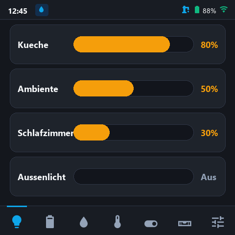
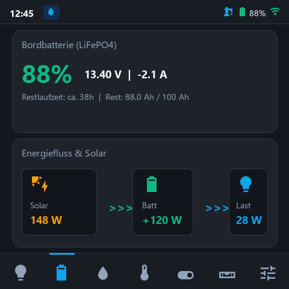
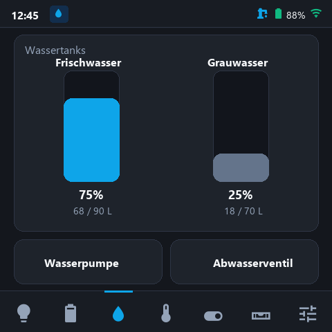
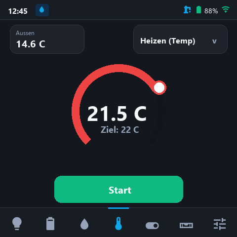
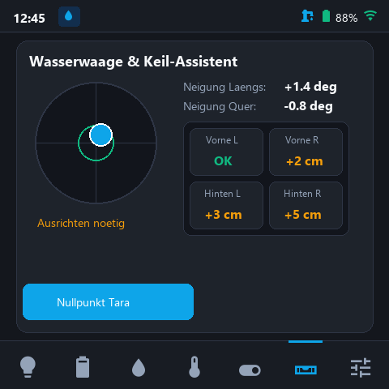
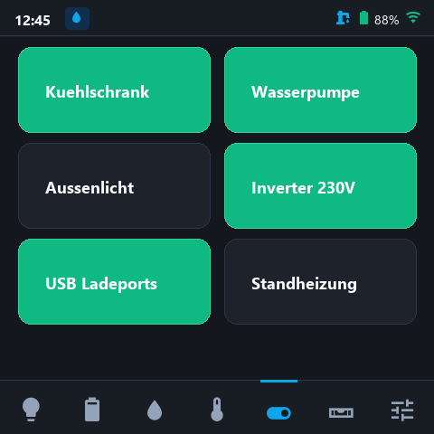

# CamperUI 🚐✨
> **Modernes, hochauflösendes Touch-Bedienpanel für VanPi & Campervans**  
> Entwickelt für das **Waveshare ESP32-S3-Touch-LCD-4** (4.0 Zoll, 480x480 RGB, kapazitiver Touch) mit **LVGL 8.4**.

---

## 📸 Screenshots & Benutzeroberfläche

| 💡 Dimmer & Licht (Home Assistant Style) | ⚡ Energie & Powerfluss |
| :---: | :---: |
|  |  |
| *Moderne 32px HA-Slider ohne Kugel, 4 Dimmer bündig* | *Live-Berechnung: Solar -> Batterie -> Camper-Last* |

| 💧 Wassertanks & Ventile | 🌡️ Klima & Standheizung |
| :---: | :---: |
|  |  |
| *160px hohe Füllstandsbalken & Schnellzugriff-Buttons* | *Thermostat-Bogen mit Greifknob & Modusauswahl* |

| ⚖️ Wasserwaage & Keil-Assistent | 🔌 Relais & Schalter |
| :---: | :---: |
|  |  |
| *2D Dosenlibelle & 4-Rad Keilausgleich in cm* | *Kompakte 2x3 Kacheln mit Status-Rückmeldung* |

---

## 🌟 Highlights & Funktionen

### 1. 💡 Dimmer / Beleuchtung (Home Assistant Style)
* **Tile-Slider-Design:** Inspiriert von modernen Smart-Home-Dashboards (Home Assistant / Mushroom).
* **32px dicke Füllstandsbalken:** Deutlich sichtbare Führungsschiene mit dezentem Rand und sanfter Abrundung.
* **Kein Kugelknopf:** Bei 0% ist der Balken komplett leer (kein störender Knauf am Rand).
* **Optimierte Touchbedienung:** Stufenloses Wischen oder direktes Antippen der gewünschten Helligkeit.
* **Exakte Passform:** Genau 4 Dimmer füllen das 480x480 Display perfekt aus, ohne vertikales Scrollen.

### 2. ⚡ Energie & Batterie-Dashboard
* **Intelligenter Energiefluss:** Dynamische Berechnung der aktuellen Camper-Last ({\\text{last}} = P_{\\text{solar}} - P_{\\text{batt}}$) und Richtungspfeile.
* **LiFePO4 Batterie-Monitoring:** Präzise Anzeige von Ladezustand (SoC %), Spannung (V), Lade-/Entladestrom (A) und Restlaufzeit.
* **Solar-Einspeisung:** Live-Erfassung der PV-Leistung in Watt.

### 3. 💧 Wassertanks & Pumpensteuerung
* **Große 160px Füllstandsbalken:** Klare Farbtrennung (Frischwasser Cyan, Grauwasser Schiefergrau).
* **Exakte Zentrierung:** Perfekt ausgerichtete Beschriftungen, Liter- und Prozentanzeigen.
* **Schnellschalter:** Große Buttons für Wasserpumpe und elektrisches Abwasserventil.

### 4. 🌡️ Klima & Heizungssteuerung
* **Thermostat-Drehbogen:** Großzügiger Arc-Slider mit weißem, kontraststarkem Bedienknob und Schlagschatten.
* **Modus-Auswahl:** Schnellumschaltung zwischen *Heizen (Temp)*, *Heizen (Stufe)* und *Lüften*.
* **Status auf einen Blick:** Außentemperatur oben links, Ist- und Zieltemperatur zentriert im Bogen.

### 5. ⚖️ Digitale Wasserwaage & Keil-Assistent
* **2D-Dosenlibelle:** Präzise grafische Libelle mit 0.5°-Toleranz-Zielring und Längs-/Querneigung in Grad.
* **Keil-Ausgleichsassistent:** Berechnet aus Geometrie und Neigungswinkeln direkt die benötigte Unterleghöhe in **Zentimetern** für jedes einzelne Rad (*Vorne L*, *Vorne R*, *Hinten L*, *Hinten R*).
* **Tara-Funktion:** Sendet den aktuellen Nullpunkt direkt an den VanPi-Neigungssensor.

### 6. 🔌 Lastrelais / Verbraucher
* Bis zu 8 individuell benennbare Relais.
* Farbliches Zustandsfeedback (Grün aktiv, Anthrazit Standby).

### 7. 🔔 Smart Header Badges & Alarme
* **WLAN & Empfang:** Mehrstufige Signalstärkeanzeige (Grün / Gelb / Rot).
* **Dynamische Warn-Badges:** Erscheinen automatisch im Header bei:
  * ❄️ Frostgefahr (Außentemperatur unter Grenzwert)
  * 🔋 Niedriger Batteriestand (SoC unter Grenzwert)
  * 💧 Frischwassermangel (unter Minimalwert)
  * ⚠️ Abwassertank voll (über Maximalwert)
* **Alle Grenzwerte frei konfigurierbar** und im NVS-Flash gespeichert.

### 8. ⚙️ Einstellungen & Offline-Simulation
* On-Screen-Tastatur zum Konfigurieren von WLAN-SSID, Passwort und VanPi-IP.
* Display-Timeout, Helligkeit und Dark/Light-Mode.
* **Integrierter Debug-Modus:** Simuliert realistische Sensordaten per Knopfdruck – ideal zum Testen ohne Fahrzeug.

### 9. 🔊 Haptisches Feedback (Touch-Ton)
* **Onboard-Buzzer Anbindung:** Akustische Rückmeldung für Berührungen und Tastendrücke über den hardwareseitigen Piezo-Buzzer des Displays.
* **Präziser 3-ms Klick:** Extrem kurzer Mikrosekunden-Impuls erzeugt ein dezentes mechanisches "Tick"-Geräusch statt eines störenden Piepens.
* **Intelligente Filterung:** Löst nur bei echten Klicks auf Buttons, Schalter, Tabs und Tastaturtasten aus – kein Ton beim Wischen, Scrollen oder Aufwecken des Displays.
* **In den Einstellungen konfigurierbar:** Unter *Einstellungen → Allgemein* per Schalter ("Touch-Ton") jederzeit an- und abschaltbar.

### 10. 📟 Web-Terminal & Live Debug-Monitor
* **Drahtlose Fehlerdiagnose:** Vollständiger Zugriff auf serielle Meldungen und Debug-Logs direkt im Browser unter `http://<IP>/status` – ohne USB-Kabel.
* **1-Klick Foren-Export:** "In die Zwischenablage kopieren"-Button zum schnellen Teilen von Logs bei Support-Fragen oder Fehlerberichten.
* **Interaktive Schnellbefehle:** WLAN-Diagnose (`w`), Demo-Modus (`d`), Buzzer-Test (`b`) oder Display-Resync (`s`) direkt per Weboberfläche auslösen.
* **64 KB PSRAM-Puffer:** Schneller, entkoppelter Ringpuffer im Octal-PSRAM ohne Belastung des internen Heaps.

---

## 🛠️ Hardware-Anforderungen

* **Board:** [Waveshare ESP32-S3-Touch-LCD-4](https://www.waveshare.com/esp32-s3-touch-lcd-4.htm)
* **Display:** 4.0 Zoll IPS, 480 × 480 Pixel, RGB-Interface (ST7701S Treiber)
* **Touchpanel:** Kapazitiver I2C-Touchcontroller (Goodix GT911)
* **Speicher:** 16 MB Quad-SPI Flash, 8 MB Octal-SPI PSRAM
* **Konnektivität:** 2.4 GHz Wi-Fi & Bluetooth 5 (LE)

---

## 💻 Kompilierung & Flashen

### Empfohlene Einstellungen (Arduino IDE 2.x / CLI)

| Option | Einstellung |
| :--- | :--- |
| **Board** | ESP32S3 Dev Module |
| **USB CDC On Boot** | Enabled |
| **Flash Size** | 16MB (128Mb) |
| **Partition Scheme** | 16M Flash (3MB APP/9.9MB FATFS) (`app3M_fat9M_16MB`) |
| **PSRAM** | OPI PSRAM |

### LVGL-Konfiguration installieren

Die getestete Konfiguration für LVGL 8.4 liegt unter `config/lv_conf.h`.

1. Den Sketchbook-Speicherort unter **Datei → Voreinstellungen** in der Arduino IDE prüfen.
2. Eine vorhandene `libraries/lv_conf.h` sichern.
3. `config/lv_conf.h` in den `libraries`-Ordner des Sketchbooks kopieren, direkt neben den Ordner `lvgl`.
4. CamperUI erneut kompilieren und hochladen.

Die Konfiguration verwendet 128 KiB LVGL-Speicher statt der 48 KiB aus dem getesteten Waveshare-Paket. Auf einem Waveshare Rev04 behob diese Änderung einen Startabsturz beim Aufbau der CamperUI-Oberfläche.

### Flashen via USB (Arduino CLI)

```powershell
arduino-cli compile --upload -p COM4 --fqbn esp32:esp32:esp32s3:CDCOnBoot=cdc,PSRAM=opi,FlashSize=16M,PartitionScheme=app3M_fat9M_16MB CamperUI.ino
```

---

## 🔄 Firmware-Updates (Web-OTA über den Browser)

CamperUI verfügt über einen integrierten, extrem schnellen lokalen Web-Update-Server. Sobald CamperUI im WLAN angemeldet ist, können zukünftige Firmware-Updates **vollständig drahtlos direkt über jeden Webbrowser** installiert werden – ohne USB-Kabel, ohne serielle Treiber und ohne Arduino IDE!

### 🌐 Update-Interface aufrufen

1. Stelle sicher, dass sich dein Endgerät (PC, Mac, Smartphone oder Tablet) im selben WLAN-Netzwerk wie das CamperUI-Display befindet.
2. Ermittle die IP-Adresse des Displays:
   * Auf dem Display: **Einstellungen** (Zahnrad) → Tab **Netzwerk**.
   * Dort werden die aktuelle IP-Adresse und der direkte Update-Link angezeigt.
3. Öffne im Browser deiner Wahl:
   ```text
   http://camperui.local/update
   ```
   *Alternativ über die direkte IP-Adresse:*
   ```text
   http://<IP-Adresse-des-Displays>/update   (z. B. http://192.168.1.182/update)
   ```

### 🚀 Update durchführen (Schritt für Schritt)

1. **Firmware herunterladen:**
   * Lade die gewünschte Update-Datei (z. B. `CamperUI-V1.0.2.bin`) aus den GitHub Releases oder dem lokalen `build/`-Ordner herunter.
2. **Datei auswählen:**
   * Ziehe die `.bin`-Datei per **Drag & Drop** in das Upload-Feld im Browser oder klicke auf **"Firmware-Datei auswählen"**.
3. **Installation starten:**
   * Klicke auf den Button **"Firmware installieren"**.
4. **Automatischer Installationsvorgang:**
   * Der Upload dauert im lokalen WLAN ca. **2 bis 3 Sekunden**. Der Fortschrittsbalken im Browser zeigt den Live-Status an.
   * Während des Flash-Schreibvorgangs schaltet das Display automatisch kurz ab, um Speicherbus-Konflikte und Farbrauschen zu vermeiden.
   * Sobald der Upload abgeschlossen ist, meldet die Weboberfläche Erfolg und der ESP32 startet automatisch neu.
5. **Fertig:**
   * Das Display startet direkt mit der neuen Version und allen bestehenden Einstellungen!

> [!NOTE]
> **Für Entwickler (Erstellen eigener Update-Binaries):**
> Um eine kompatible `.bin`-Datei für das Web-OTA Update zu erzeugen, kompilieren Sie mit dem Parameter `--output-dir`:
> ```powershell
> arduino-cli compile --output-dir ./build -b esp32:esp32:esp32s3:CPUFreq=240,CDCOnBoot=cdc,PSRAM=opi,FlashSize=16M,PartitionScheme=app3M_fat9M_16MB CamperUI.ino
> ```
> Verwenden Sie für das Web-Update die generierte Datei `build/CamperUI.ino.bin` (bzw. `CamperUI-Vx.x.x.bin`).
> *(Die Datei `merged.bin` enthält den Bootloader sowie die Partitionstabelle ab Flash-Adresse `0x00` und ist ausschließlich für das erstmalige Flashen per USB über `esptool` gedacht!)*

---

## 📟 Web-Terminal & Live Debug-Monitor (`/status`)

CamperUI verfügt über ein integriertes, browserbasiertes **Web-Terminal**. Sämtliche seriellen Konsolenausgaben, Netzwerk-Meldungen und System-Diagnosen werden drahtlos in Echtzeit über jeden Webbrowser bereitgestellt – **ohne USB-Kabel oder serielle Konsole**.

### 🌐 Web-Terminal aufrufen

Öffne im Browser deiner Wahl:
```text
http://camperui.local/status
```
*Alternativ über die IP-Adresse:*
```text
http://<IP-Adresse-des-Displays>/status   (z. B. http://192.168.1.182/status)
```
*(Ein direkter Button oben rechts auf der Update-Seite `/update` führt ebenfalls dorthin.)*

### 📋 Funktionen & Werkzeuge

* **1-Klick Zwischenablage (`📋 In die Zwischenablage kopieren`):**
  * Kopiert den gesamten Logverlauf auf Knopfdruck in die Zwischenablage.
  * Ideal, um Debug-Daten bei Fragen im Forum oder für GitHub-Fehlerberichte zu teilen.
* **64 KB PSRAM-Ringpuffer:**
  * Puffert ca. 1.000 bis 1.500 Zeilen der neuesten Debug-Ausgaben (WLAN-Events, Touch-Eingaben, Sensorabfragen, HTTP-Worker-Logs).
  * Vollständig im 8-MB Octal-PSRAM abgelegt, um internen Heap-Speicher zu schonen.
* **Live System-Status-Kacheln:**
  * Übersicht über Uptime, freiem internem Heap, PSRAM, WLAN-Signalstärke (RSSI in dBm), IP-Adresse und VanPi-Verbindungsstatus.
* **Auto-Refresh & Auto-Scroll:**
  * Fragt alle 2 Sekunden neue Logs ab und scrollt automatisch zum Ende.
* **Interaktive Schnellbefehle:**
  * `[w]` WLAN & Speicher-Diagnose abrufen
  * `[d]` Simulationsmodus (Demo vs. Live-VanPi) umschalten
  * `[b]` Buzzer-Test (50 ms)
  * `[s]` RGB-Panel Resynchronisierung auslösen
  * `[r]` Display neu zeichnen
  * `[n]` LVGL Heap-Integritätsprüfung
  * Eigenes Eingabefeld zum Senden beliebiger Terminal-Kommandos an den ESP32.
* **Export & Bereinigung:**
  * `📥 Als Text speichern`: Lädt die Logs direkt als Datei `camperui-debug.log` herunter.
  * `🗑️ Leeren`: Setzt den Logpuffer im Display zurück.

---

## 📁 Projektstruktur

```text
CamperUI/
├── CamperUI.ino            # Hauptprogramm, Setup & Main-Loop
├── ui_main.cpp / .h        # LVGL-Initialisierung, Status-Bar, Navigation, Theme
├── ui_power.cpp            # Tab 1: Batterie & Energiefluss
├── ui_water.cpp            # Tab 2: Wassertanks & Pumpensteuerung
├── ui_climate.cpp          # Tab 3: Thermostat & Standheizung
├── ui_switches.cpp         # Tab 0 & 4: Dimmer & Schalter
├── ui_level.cpp            # Tab 5: Wasserwaage & 4-Rad Keilassistent
├── ui_settings.cpp         # Tab 6: Systemeinstellungen & Kalibrierung
├── web_ota.cpp / .h        # Web-Server für OTA-Updates & Web-Terminal Endpunkte
├── web_terminal_html.h     # Eigenständiges Dark-Theme Web-Terminal UI
├── debug_log.cpp / .h      # 64 KB PSRAM-Ringpuffer & Serial-Multiplexer
├── buzzer.cpp / .h         # Nicht-blockierende haptische Buzzer-Ansteuerung
├── ui_mdi_icons.c / .h     # 32px & 18px Material Design Vektor-Icon-Fonts
├── http_handler.cpp / .h   # VanPi REST-Client & HTTP-Publisher
├── system_state.cpp / .h   # Datenmodell & NVS-Flash-Persistenz
├── tools/                  # Hilfswerkzeuge
│   ├── gen_mdi_script.py   # Icon-Font Generator
│   ├── simulate_vanpi.py   # Lokaler VanPi Mock-Server
│   └── materialdesignicons-webfont.ttf
└── docs/                   # Dokumentation & Assets
    ├── screenshots/        # 480x480 Display-Vorschauen
    └── flows.json          # Node-RED Referenz-Flows
```

---

## 🔗 VanPi Schnittstellen & Endpunkte

CamperUI kommuniziert bidirektional über das VanPi HTTP REST-Interface:
* GET /api/v1/ bzw. GET /state: Abfrage aller Live-Sensoren (Batterie, Solar, Tanks, Relais, Klima).
* POST /api/v1/relays: Schalten der Relais und Lastkreise.
* POST /api/v1/dimmers: Einstellen von Helligkeitswerten (0-100%).
* POST /position_sensor/?request=calibrate: Nullpunkt-Kalibrierung der Wasserwaage.

---

## 📄 Lizenz
Open-Source (MIT License). Entwickelt für die VanPi Camper-Community.

### Lokale WLAN-Vorgabe

1. `config/wifi_secrets.example.h` nach `config/wifi_secrets.h` kopieren.
2. SSID und Passwort in die beiden Anführungszeichen eintragen.
3. Sketch neu kompilieren und hochladen.

Ohne gespeicherte SSID übernimmt CamperUI diese Vorgabe und speichert sie auf
dem Display. Bereits gespeicherte Zugangsdaten haben Vorrang; Änderungen sind
weiterhin unter Einstellungen möglich. Das gespeicherte WLAN bleibt auch nach
einem Scan in der Auswahlliste, wenn es gerade nicht erreichbar ist.

Ohne lokale Datei oder mit leerer Vorgabe funktioniert der bisherige Ablauf.
`config/wifi_secrets.h` wird von Git ignoriert. Nur die leere Vorlage committen.
Anführungszeichen im Passwort als `\"`, Backslashes als `\\` schreiben.

### MaxxFan-Layout-Demo

Der MaxxFan-Tab zeigt eine bedienbare Vorschau ohne Hardwarebefehle oder
Live-Status. AUF/ZU ändern die Klappenzeichnung; EIN/AUS schaltet den
simulierten Lüfterstatus. Stufe 1–10, OUT/IN, Zieltemperatur 10–40 °C und
AUTO sind lokale Demo-Werte, keine bestätigten Gerätegrenzen.
Das Lüftersymbol neben der Heizungsflamme erscheint nur bei simuliertem
Lüfterbetrieb. Eine allein geöffnete Klappe aktiviert es nicht.
Reset setzt nur die Vorschau zurück. MaxxFan-Einstellungen und VanPi-Anbindung
folgen nach Klärung der Befehle und Statusfelder.

### Feste Hauptnavigation (Layout v8)

Die Hauptansicht hat drei getrennte Bereiche: Statusleiste (y=0, Höhe 40),
Content (y=40, Höhe 380), Navigation (y=420, Höhe 60). Die neun Hauptseiten
liegen im Content-Container und werden nur ein-/ausgeblendet. Die Navigation
wird einmal erstellt und bleibt per Finger horizontal scrollbar. Ein Seitenklick
verschiebt die Leiste nicht automatisch; Nachlauf, elastisches Scrollen und
Fokus-Autoscroll sind deaktiviert. Die feste Geometrie der Leiste und ihrer
Buttons ist unabhängig vom Standard-Theme; Buttons wachsen beim Drücken nicht.
Die Leistenposition bleibt beim Farbmoduswechsel erhalten. Das frühere Haupt-Tabview
mit zusätzlich versteckter Icon-Leiste ist entfernt. Die separaten
System-Einstellungen behalten ihre eigenen Einstellungsreiter.

Die Testanleitung steht in `TEST-HOME.md`. Die serielle Startmeldung `[NAV v8]`
kennzeichnet diesen Stand. Mit `n` im seriellen Monitor lassen sich die aktuelle
Geometrie und der LVGL-Speicher prüfen. Vor und nach den regulären Datenupdates
werden Geometrieabweichungen protokolliert, ohne die Leiste zurückzusetzen.

Beim Farbmoduswechsel wird der UI-Neuaufbau nach dem Event durchgeführt;
die alten Screens werden vorher gelöscht. So sammeln sich keine alten Screens an.

MaxxFan verwendet zwei gleich große 140×54-px-Assets mit Transparenz:
`assets/maxxfan/maxxfan_open.png` und `maxxfan_closed.png`. Die Firmware
verwendet die eingebetteten Daten in `ui_maxxfan_assets.c`, keine SD-Karte.
Die SVG-Quellen und `tools/generate_maxxfan_assets.py` ermöglichen reproduzierbare
Änderungen. Grafikfarben bleiben in beiden Farbmodi identisch.

Hardwareprüfung: alle neun Seiten mehrfach wechseln, die Navigation in beide
Richtungen scrollen, MaxxFan AUF/ZU/EIN/AUS prüfen, System-Einstellungen öffnen
und zurückkehren sowie Farbmodus mehrmals wechseln. Die korrekte Darstellung
auf dem ESP32 ist zusätzlich zu den lokalen Logikprüfungen zu bestätigen.

### Home und WLAN in V8.7

Home nutzt die gemeinsamen Dummy-/Live-Daten statt eigener statischer Messwerte.
Temperaturquellen, zwei Relais-/Dimmer-Favoriten, Tankquelle und sichtbare Karten
lassen sich auf einer eigenen Home-Einstellungsseite zuweisen; der Zugang liegt
unter dem System-Einstellungen-Button. Die Auswahl wird dauerhaft gespeichert.
Vorhandene Dummy-Daten werden wiederverwendet, fehlende Kanaele ergaenzt.
Fehlende Messwerte erscheinen als `--`. Starterspannung ist eine optionale
`starter_voltage`-Erweiterung in `/batt`; ohne API-Wert bleibt die Live-Anzeige leer.
MaxxFan bleibt eine lokale Vorschau ohne belegte Live-Anbindung.

Batterie und Solar sind nebeneinander gleich breit. Solar-Watt erscheint orange;
die Batterie-Ueberschrift ist ueber 40 % gruen, bei 20–40 % gelb und unter 20 % rot.
Die Home-Checkboxen haben groessere, getrennte Touchflaechen.

Die Netzwerkseite besitzt einen Passwort-Anzeigen/Verbergen-Taster und zeigt
realen WLAN-Status, IP, RSSI, Hostname und den letzten Trennungsgrund mit Hinweisen.
Auch im Dummy-Modus wird eine WLAN-Verbindung nicht mehr simuliert. WLAN und
VanPi-Erreichbarkeit werden getrennt dargestellt. Passwortwerte erscheinen nicht
in Diagnosemeldungen. Der Hostname lautet `esp32s3-camper-ui`.

Die RGB-Ausgabe nutzt projektlokale Anpassungen aus Arduino_GFX 1.5.3 mit
beibehaltenem BSD-Lizenztext. Sie erfordern Arduino-ESP32 3.x; die Ueberpruefung
lief mit Core 3.3.12, LVGL 8.4.0 und Arduino_GFX 1.5.3. RGB-Timing bleibt 12 MHz,
der LVGL-Zeichenpuffer liegt im internen RAM. Eine Resynchronisierung wird am
Frame-Ende und nach Einstellungs-Speichervorgaengen angefordert.

**Teststand und Grenzen:** V8.7 kompiliert erfolgreich fuer ESP32-S3 mit OPI-PSRAM
und 16-MB-Flash. Der Hardwaretester berichtet mehrere erfolgreiche Resets und
Aus-/Einstecktests an einer Powerbank sowie eine leichtere WLAN-Einrichtung.
Die gelegentliche Bildverschiebung ist deutlich reduziert, aber nicht als
vollstaendig behoben bestaetigt. Ein schwarzes/verzoegertes Bild beim PC-Betrieb
bzw. Schliessen der Arduino IDE bleibt offen; beim Powerbank-Test wurde ein
anderes Kabel verwendet. Langzeittest, Live-Daten und Live-Schaltbefehle sind
noch gesondert zu validieren. Dies ist keine Freigabe als fertige stabile Firmware.
